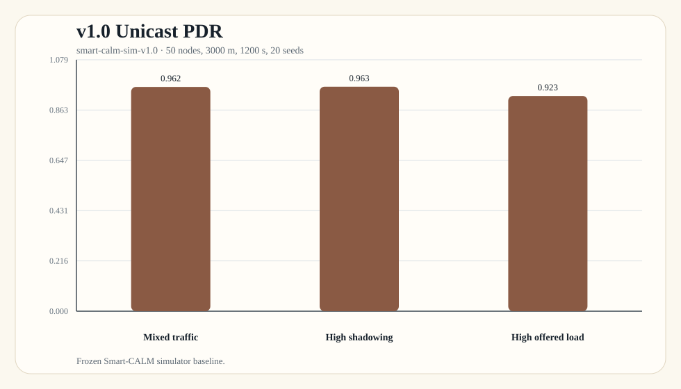
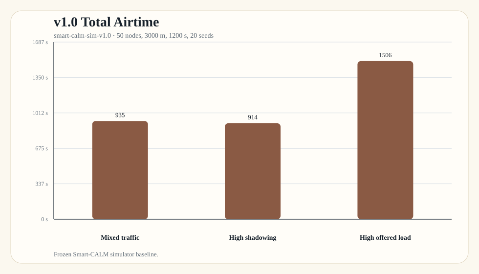
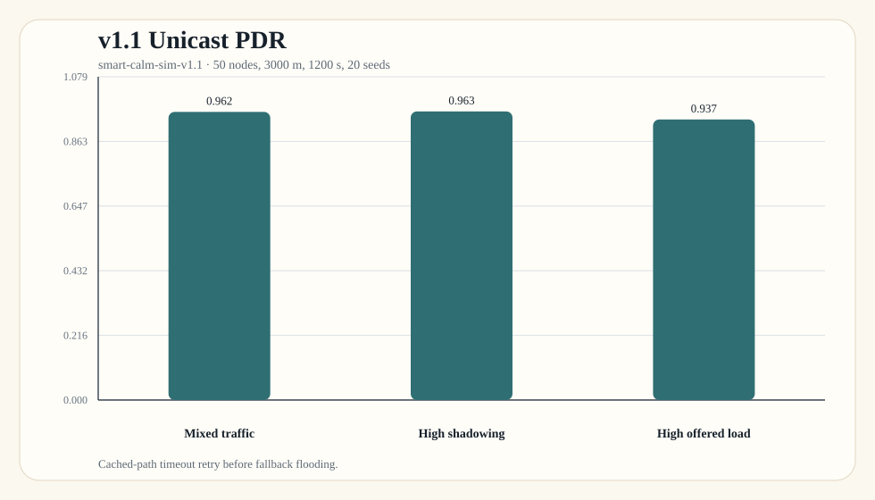
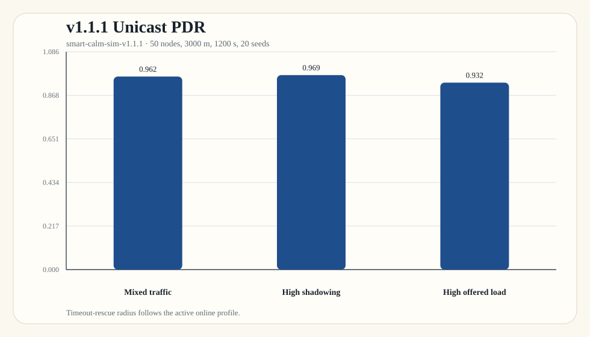
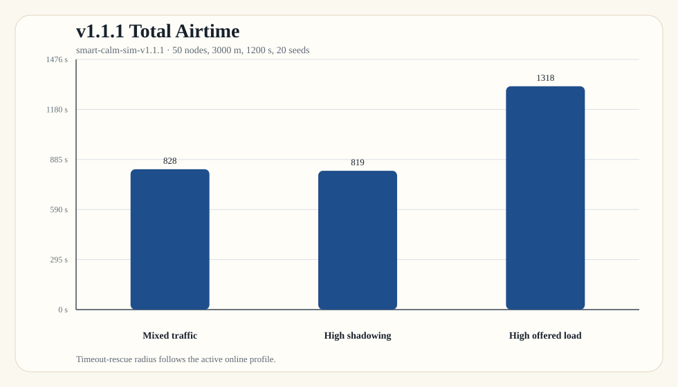
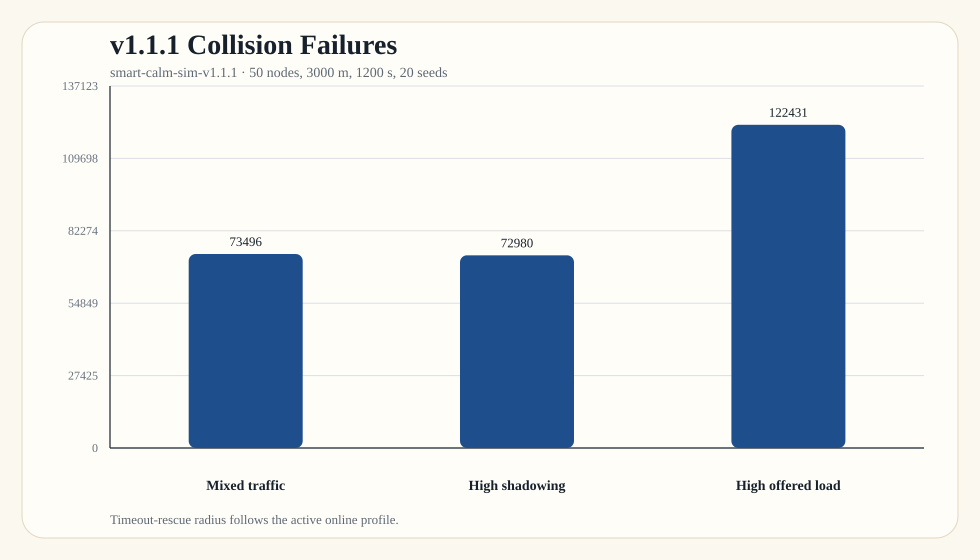
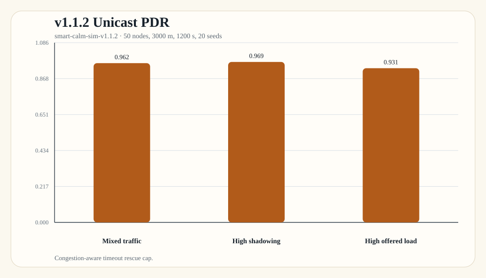
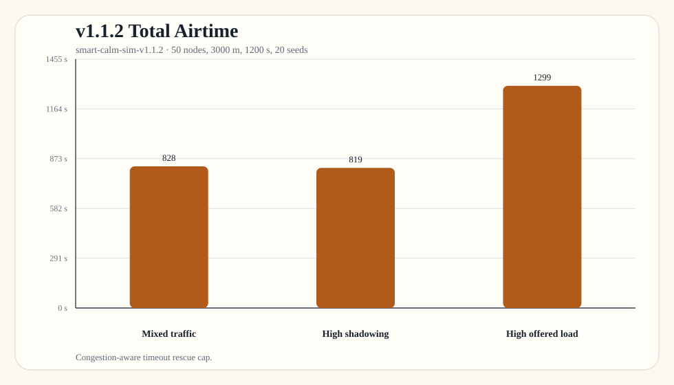
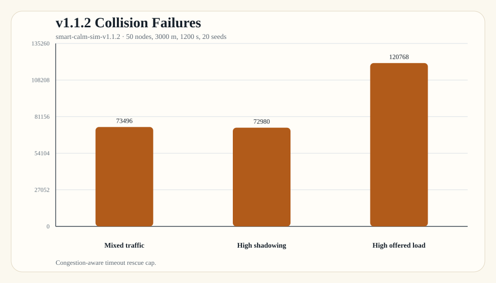

# Smart-CALM Tag Gallery

Versioned Smart-CALM simulation tags and their bar charts.

Formal scenarios use `50 nodes / 3000 m / 1200 s / mixed traffic / pair-count 8 / 20 seeds` unless noted.

| Tag | Commit | Version focus | Mixed PDR | Mixed airtime (s) | Mixed collisions | High-load PDR | High-load airtime (s) | High-load collisions |
| --- | --- | --- | ---: | ---: | ---: | ---: | ---: | ---: |
| `smart-calm-sim-v1.0` | `c7626c7` | Frozen Smart-CALM simulator baseline. | 0.962 | 935 | 83492 | 0.923 | 1506 | 140102 |
| `smart-calm-sim-v1.1` | `075ad8d` | Cached-path timeout retry before fallback flooding. | 0.962 | 896 | 79562 | 0.937 | 1410 | 131345 |
| `smart-calm-sim-v1.1.1` | `a1a4380` | Timeout-rescue radius follows the active online profile. | 0.962 | 828 | 73496 | 0.932 | 1318 | 122431 |
| `smart-calm-sim-v1.1.2` | `1aee34a` | Congestion-aware timeout rescue cap. | 0.962 | 828 | 73496 | 0.931 | 1299 | 120768 |

## `smart-calm-sim-v1.0`

Frozen Smart-CALM simulator baseline.

## `smart-calm-sim-v1.1`

Cached-path timeout retry before fallback flooding.

## `smart-calm-sim-v1.1.1`

Timeout-rescue radius follows the active online profile.

## `smart-calm-sim-v1.1.2`

Congestion-aware timeout rescue cap.

