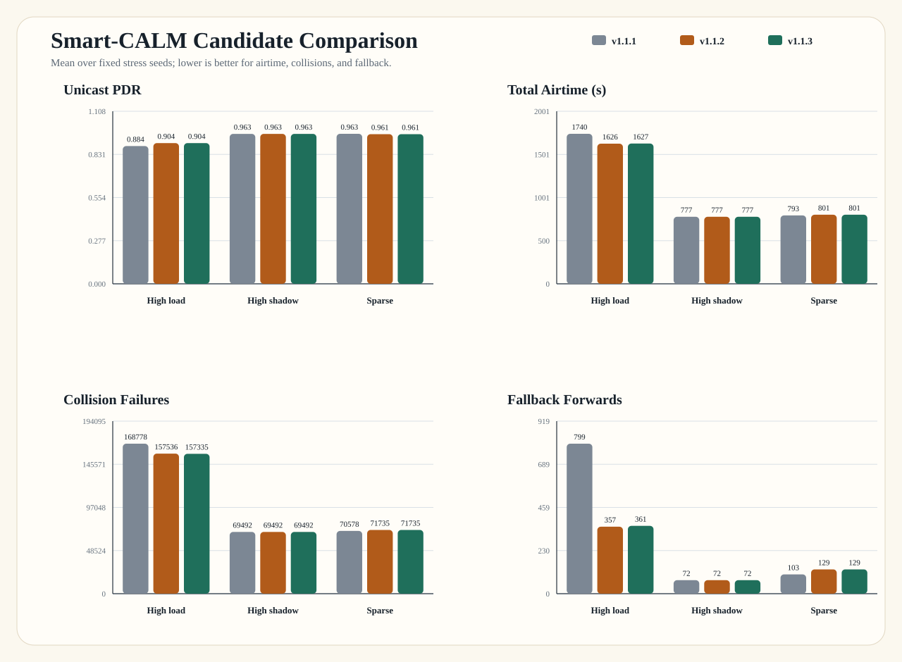

# Smart-CALM v1.1.2/v1.1.3 Candidates

This page records the congestion-aware timeout rescue candidates and the
literature-backed fallback budget controller (FBC) candidate.

## Summary

- Goal: keep Smart-CALM PDR high while reducing fallback over-spread when the
  channel is already congested.
- v1.1.2 change: timeout rescue uses a congestion-aware TTL cap when the active
  profile is already the rescue profile and recent collision pressure is high.
- v1.1.3 change: fallback rescue is controlled by FBC, a smoothed pressure and
  hysteresis controller inspired by RPL/MRHOF, Trickle, ETX, and
  broadcast-storm work.
- Status: v1.1.3 is more explainable algorithmically, while v1.1.2 remains the
  slightly stronger pure metric point on fallback count.

## Latest Results

Stress scenarios use `50 nodes / 1200 s / mixed traffic / pair-count 8 / 10 seeds`.
`rate14` uses `3000 m / rate 14 / shadow 8`; `shadow8` uses
`3000 m / rate 6 / shadow 8`; `sparse4k` uses `4000 m / rate 6 / shadow 8`.

| Candidate | Scenario | Unicast PDR | Total Airtime (s) | Collision Failures | Fallback Forwards | Avg Delay (s) |
| --- | --- | ---: | ---: | ---: | ---: | ---: |
| v1.1.2 | High load (`rate14`) | `0.904` | `1626` | `157536` | `357` | `14.327` |
| v1.1.3 | High load (`rate14`) | `0.904` | `1627` | `157335` | `361` | `14.456` |
| v1.1.3 | High shadowing (`shadow8`) | `0.963` | `777` | `69492` | `72` | `9.242` |
| v1.1.3 | Sparse (`sparse4k`) | `0.961` | `801` | `71735` | `129` | `7.304` |

## Interpretation

- `rate14` is the real win versus v1.1.1: PDR improves, airtime drops,
  collision failures drop, and fallback forwarding drops sharply.
- v1.1.3 is nearly tied with v1.1.2 on stress metrics: PDR is unchanged,
  collisions are slightly lower, and fallback/airtime are slightly higher.
- `shadow8` stays essentially unchanged.
- `sparse4k` remains close to v1.1.1, with a small airtime/fallback increase;
  keep monitoring this edge case before freezing the baseline.

## Result Files

- `results/v1_1_2_rate14_smart.csv`
- `results/v1_1_2_shadow8_smart.csv`
- `results/v1_1_2_sparse4k_smart.csv`
- `results/v1_1_3_rate14_smart.csv`
- `results/v1_1_3_shadow8_smart.csv`
- `results/v1_1_3_sparse4k_smart.csv`
- `results/figures/smart_calm_candidates/smart_calm_candidate_comparison.svg`
