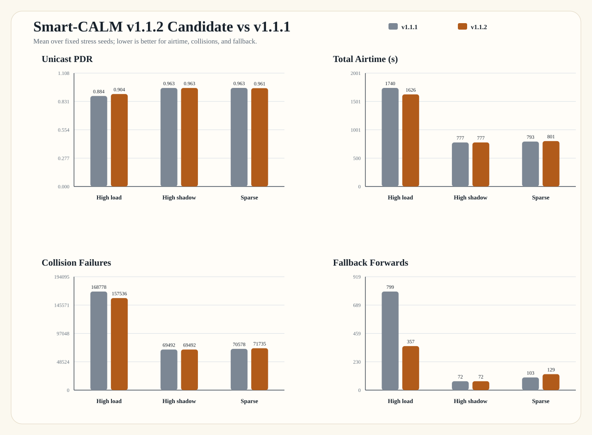

# Smart-CALM v1.1.2 Candidate

This page records the current congestion-aware timeout rescue candidate on
branch `version/v1.1.2`.

## Summary

- Goal: keep Smart-CALM PDR high while reducing fallback over-spread when the
  channel is already congested.
- Change: timeout rescue uses a congestion-aware TTL cap when the active
  profile is already the rescue profile and recent collision pressure is high.
- Status: promising candidate, not yet the final accepted baseline.

## Latest Results

Stress scenarios use `50 nodes / 1200 s / mixed traffic / pair-count 8 / 10 seeds`.
`rate14` uses `3000 m / rate 14 / shadow 8`; `shadow8` uses
`3000 m / rate 6 / shadow 8`; `sparse4k` uses `4000 m / rate 6 / shadow 8`.

| Scenario | Unicast PDR | Total Airtime (s) | Collision Failures | Fallback Forwards | Avg Delay (s) |
| --- | ---: | ---: | ---: | ---: | ---: |
| High load (`rate14`) | `0.904` | `1626` | `157536` | `357` | `14.327` |
| High shadowing (`shadow8`) | `0.963` | `777` | `69492` | `72` | `9.242` |
| Sparse (`sparse4k`) | `0.961` | `801` | `71735` | `129` | `7.304` |

## Interpretation

- `rate14` is the real win: compared with v1.1.1, PDR improves, airtime drops,
  collision failures drop, and fallback forwarding drops sharply.
- `shadow8` stays essentially unchanged.
- `sparse4k` remains close to v1.1.1, with a small airtime/fallback increase;
  keep monitoring this edge case before freezing the baseline.

## Result Files

- `results/v1_1_2_rate14_smart.csv`
- `results/v1_1_2_shadow8_smart.csv`
- `results/v1_1_2_sparse4k_smart.csv`
- `results/figures/smart_calm_v1_1_2/v1_1_2_candidate_comparison.svg`
